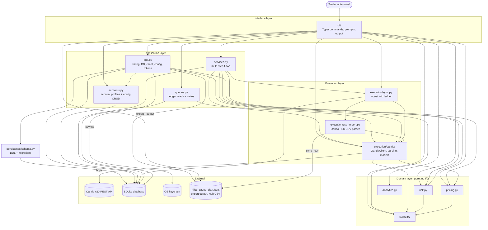
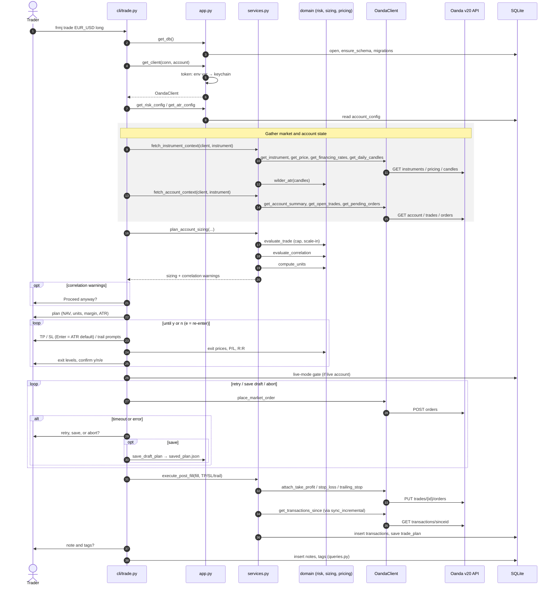
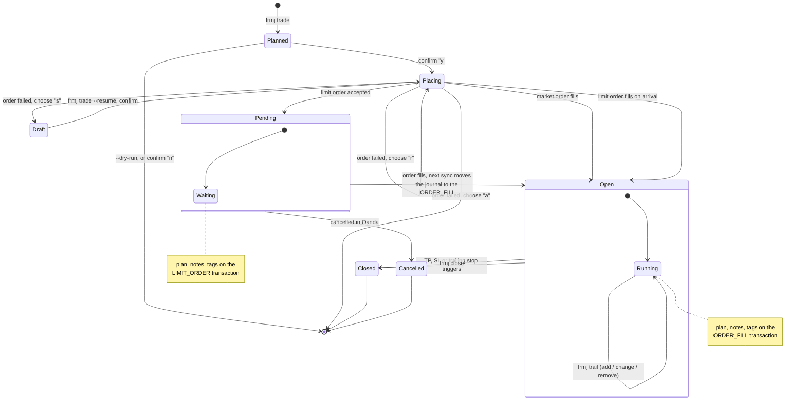
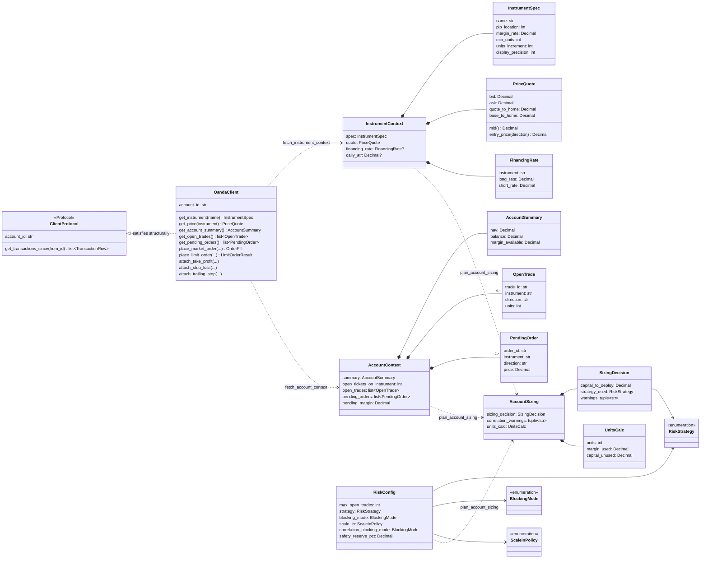
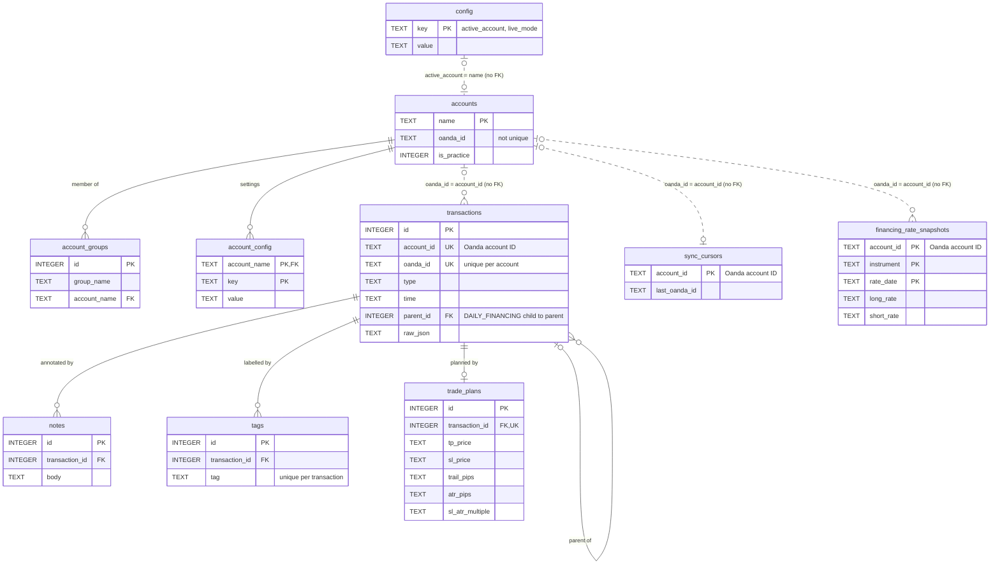

# Architecture

[← Back to README](../README.md)

```
src/frmj/
├── cli/                # Typer CLI — prompts/output, thin shell over services, queries + app layer
│   ├── __init__.py     # The Typer app; registers each command module
│   ├── sync.py, trade.py, positions.py, ...   # One module per command (or command family)
│   ├── _trade_helpers.py, _trade_multi.py     # TP/SL prompts and the --multi flow for trade
│   └── _display.py, _completion.py            # Output formatting and tab completion shared across commands
├── services.py         # Multi-step flows (trade planning, post-fill, positions, close) — no Typer dependency
├── queries.py          # Plain SQL reads/writes on the ledger: transactions, notes, tags, plans, snapshots
├── app.py              # Wiring: DB factory, client factory, config helpers, keychain
├── accounts.py         # Pure SQLite CRUD for named account profiles and live-mode flag
├── domain/
│   ├── risk.py         # Pure risk model: trade cap, scale-in policy, sizing decision
│   ├── sizing.py       # Pure unit sizing: capital → units respecting margin formula
│   ├── pricing.py      # Pure exit pricing: TP/SL pips or %RoM → prices, P/L, R:R
│   └── analytics.py    # Pure trade statistics behind `frmj stats`
├── execution/
│   ├── oanda/
│   │   ├── client.py   # OandaClient — httpx wrapper for Oanda v3 REST API
│   │   ├── parsing.py  # Pure functions: Oanda API dicts → dataclasses
│   │   └── models.py   # Dataclasses shared by client.py and parsing.py
│   ├── csv_import.py   # Parser for Oanda Hub transaction-history CSV exports (`sync --csv`)
│   └── sync.py         # Ingestion: Oanda rows → SQLite, cursor management
└── persistence/
    └── schema.py       # SQLite DDL and ensure_schema()
```

## Components and dependencies

How the modules above depend on each other and on the outside world. The arrows were generated from the actual `import` statements in `src/frmj`; an arrow means "imports" (or, for the external stores, "reads/writes").



- **Dependencies point inward, with no cycles.** The domain layer imports only itself, and nothing outside `cli/` imports `cli/`. `services.py` does not import `app.py`: it is handed an open connection and client, which is what keeps it free of Typer and reusable from another front end.
- **`sizing.py` is the core.** `risk.py`, `pricing.py`, and the Oanda models all import it for `InstrumentSpec`, `PriceQuote`, and `Direction`.
- **Execution depends on domain, not the reverse.** `OandaClient` returns domain types (`InstrumentSpec`, `PriceQuote`, `Candle`), so API data becomes domain data at the edge.
- **`cli/` issues no SQL of its own.** Multi-step flows go through `services.py`, and every other database read or write goes through `queries.py` (ledger) or `accounts.py` (profiles and config), so another front end can reuse them as-is. `queries.py` imports only the Oanda data models, for `FinancingRate`.
- **External access is concentrated.** Only `execution/oanda` touches the network and only `app.py` touches the keychain. The database is shared: several components issue SQL against the schema defined in `persistence/`.

## Layer separation

The four domain modules (`risk`, `sizing`, `pricing`, `analytics`) are **pure functions with no I/O**. They accept data objects and return data objects. No database, no HTTP, no environment variables, no clocks. This makes them trivially testable and reusable from any future interface (GUI, REST API, back-testing harness).

The execution layer (`oanda`, `sync`) handles all network and database I/O. It feeds structured data into the domain layer and writes results to SQLite.

`accounts.py` is pure SQLite CRUD — no I/O beyond the database connection. All keychain access and environment-variable resolution happens in `app.py`.

`app.py` is the only place that resolves configuration from the environment, touches the database file or draft plan, or accesses the OS keychain. The exceptions are files the user names on the command line (`export --output` writes one, `sync --csv` reads one) and `config get`/`config check`, which look at the token environment variables only to report where the token comes from. The CLI commands call `app.py` to obtain wired-up dependencies, then pass them into `services.py` and the domain layer.

`services.py` holds multi-step operations that combine several Oanda API calls and/or domain calls into one unit — fetching the market data needed to plan a trade, evaluating risk and correlation, attaching TP/SL and syncing after a fill, fetching the data behind `positions`, and closing tickets for `close`. It takes an already-open connection and client as arguments and has no Typer dependency, so it's reusable from any future non-CLI interface. Prompting, confirmation, and terminal output stay in the `cli/` package.

`queries.py` holds the single-step SQL behind the CLI that isn't about account profiles: transaction lookups and listings (`journal`, `export`, `sync --watch`), notes and tags, trade plans, the inputs to `stats`, and financing-rate snapshots. Like `accounts.py`, each function takes an open connection and returns plain data (or `sqlite3.Row`s); nothing in it prompts, prints, or exits.

`plan_account_sizing()` is the one per-account planning step — risk check, correlation check, and unit sizing — shared by both `trade()` (called once) and the `--multi` group flow (called once per account, against a shared `InstrumentContext` but each account's own `AccountContext`), so the two commands can't drift out of sync on that logic.

## Trade flow

`frmj trade` (a plain market order) is the one flow that crosses every layer, so it shows how the pieces fit together. The other commands are slices of it: `sync`, `positions`, `close`, and `trail` each go CLI → `services.py` → `OandaClient` → Oanda, and write any results to SQLite.



Every prompt comes from `cli/trade.py`; `services.py` and the domain layer never talk to the user. All risk, sizing, and pricing math is a pure domain call, and all network traffic goes through `OandaClient`. Before the fill the database is only read; trading data (transactions, trade plan, notes, tags) is written only after Oanda confirms the order.

Variants of the same flow:

- **`--limit`** adds a limit-price prompt after sizing, sends TP/SL and any trailing stop with the order, and finishes with `execute_post_limit` instead of `execute_post_fill`.
- **`--multi GROUP`** runs the market-data block once and `plan_account_sizing` once per account, then places and post-processes each account's order in turn.
- **`--resume`** skips market data, sizing, and the TP/SL prompts: it loads `saved_plan.json`, shows the saved plan, asks for a single "Place order?" confirmation, then joins the flow at the live-mode gate.

## Trade lifecycle

The states a trade passes through from FRoMaJ's side, and where its journal (trade plan, notes, tags) is stored at each point. Oanda holds the trade itself; FRoMaJ only records it.



- **Planned** exists only in memory. Nothing is written until an order is placed, except the draft.
- **Draft** is `saved_plan.json` in the data directory: one slot, overwritten by the next save and removed once the order is placed. It records the account, so `--resume` places it on the account it was planned for.
- **Placing → Open/Pending** is where the journal is written: right after the order, FRoMaJ syncs, saves the trade plan on the fill (market) or on the LIMIT_ORDER transaction (pending limit), and prompts for a note and tags, which go on the same transaction. If that post-order sync fails, the transaction isn't in the ledger yet, so the trade plan isn't saved and the note and tags are refused with a hint to add them later with `frmj note` / `frmj tag`.
- **Pending → Open** happens at Oanda. The next `frmj sync` (or any command that auto-syncs) ingests the ORDER_FILL and moves the plan, notes, and tags from the LIMIT_ORDER transaction onto it (see [Sync flow](#sync-flow)), because `journal` and `stats` look for them on the fill. A **Cancelled** order's journal stays on its LIMIT_ORDER transaction.
- **Open → Closed** is also an Oanda event (or `frmj close`); the closing ORDER_FILL lands in the ledger on the next sync, and `stats` pairs it with the opening fill by trade ID. `frmj trail` changes the live trailing stop but not the saved trade plan, so the plan keeps what was intended at entry.

## Planning data types

Almost every class in FRoMaJ is a frozen data container (dataclass, enum, or exception); the logic lives in functions. The one class with real behavior is `OandaClient`. So a class diagram is most useful for showing how data moves through trade planning, the middle of the [trade flow](#trade-flow) above:



Solid diamonds are "contains"; dotted arrows are the `services.py` functions that build one bundle from another, not methods. Each step produces an immutable bundle the next one reads: `fetch_instrument_context` and `fetch_account_context` turn API data into `InstrumentContext` and `AccountContext`, and `plan_account_sizing` combines them with the account's `RiskConfig` into an `AccountSizing`. With `trade --multi` the group shares one `InstrumentContext`, while each account has its own `AccountContext` and `RiskConfig`.

`ClientProtocol` is the only inheritance-like relationship: `sync.py` needs just `get_transactions_since`, so tests pass any object with that method, without subclassing.

Not shown: the post-trade result types (`PostFillResult`, `CloseResult`, `TrailResult`, `PositionsView`), TP/SL pricing (`TPSLSpec`, `ExitLevels`, `TrailingStopLevels`), analytics (`ClosedTrade`, `TradeSummary`, `DirectionStats`), and the risk-check exceptions (`MaxTradesExceeded`, `ScaleInForbidden`, `CorrelatedPositionForbidden`, `BelowMinimumUnits`).

## Database schema

SQLite at the platform default path (see [`FRMJ_DB_PATH`](configuration.md#environment-variables)) or `$FRMJ_DB_PATH`. WAL mode. Foreign keys enforced.

| Table | Purpose |
|---|---|
| `accounts` | Named Oanda account profiles (name, account ID, practice flag). Active account and live-mode flag are stored in `config`. |
| `account_groups` | Named sets of accounts for `trade --multi`; one row per group membership. |
| `account_config` | Each account's own trading settings (`max_open_trades`, `risk_strategy`, ...), one row per (account, key). No shared fallback: an unset key uses its built-in default. |
| `transactions` | Append-only Oanda event ledger. Stores full raw JSON alongside parsed index columns. |
| `notes` | Free-text notes attached to transactions. |
| `tags` | Short labels attached to transactions; used in journal filters and stats breakdowns. |
| `trade_plans` | Intended TP/SL prices recorded at order time; shown in `journal` alongside fills. For a limit order the plan (and any notes/tags) sits on the pending order's transaction until sync moves it to the fill. |
| `financing_rate_snapshots` | Daily captures of Oanda's long/short financing rates, recorded by each live `frmj financing` run; read back by `financing --date`. |
| `sync_cursors` | One row per account; tracks the last ingested Oanda transaction ID for incremental sync. |
| `config` | Flat key/value store for installation-wide settings: `active_account` and `live_mode`. |



Solid lines are foreign keys SQLite enforces; dashed lines are links made only in code. The schema has two halves:

- **Profiles** (`accounts`, `account_groups`, `account_config`, `config`) are keyed by the profile *name* you choose, with real foreign keys between them.
- **The ledger** (`transactions` and everything hanging off it, `sync_cursors`, `financing_rate_snapshots`) is keyed by the *Oanda* account ID, exactly as Oanda reports it, and has no foreign key to `accounts`. Code joins the two on `accounts.oanda_id`.

Keeping them separate lets the ledger outlive its profile: `frmj account remove` deletes the profile, its config, and its group memberships but keeps its transactions, and re-adding an account with the same Oanda ID picks the history back up. It also means anything that looks a transaction up by Oanda ID must also filter by `account_id`, because Oanda IDs repeat across accounts. `accounts.oanda_id` isn't unique either: two profiles may point at one Oanda account.

Transactions are never updated or deleted — Oanda is the system of record. Corrective events arrive as new rows. The full raw JSON payload is preserved in every row so new columns can be added via migration without re-fetching from the API.

## Migration from earlier versions

If you have an existing database using the old flat-config account system (`practice_account_id`, `account_id`, `practice_mode` keys), FRoMaJ will auto-migrate on first run: it reads those keys, creates corresponding named account profiles (`"practice"` and/or `"live"`), and removes the old keys. No manual action required.

Trading settings (`max_open_trades`, `risk_strategy`, ...) used to be stored once in `config` and shared by every account. On first run after upgrading, each such value is copied into every existing account's `account_config` and removed from `config`, so every account keeps its previous behavior.
