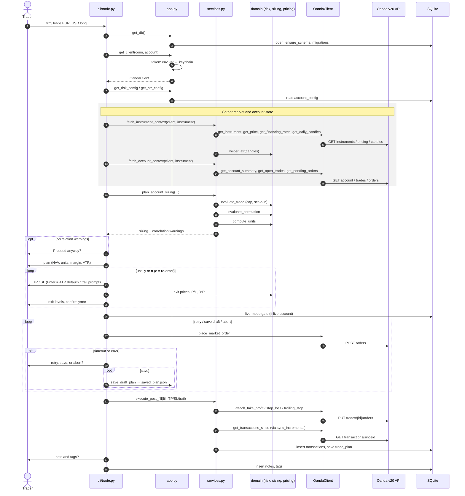

# Architecture

[← Back to README](../README.md)

```
src/frmj/
├── cli/                # Typer CLI — prompts/output, thin shell over services + app layer
│   ├── __init__.py     # The Typer app; registers each command module
│   ├── sync.py, trade.py, positions.py, ...   # One module per command (or command family)
│   ├── _trade_helpers.py, _trade_multi.py     # TP/SL prompts and the --multi flow for trade
│   └── _display.py, _completion.py            # Output formatting and tab completion shared across commands
├── services.py         # Multi-step flows (trade planning, post-fill, positions, close) — no Typer dependency
├── app.py              # Wiring: DB factory, client factory, config helpers, keychain
├── accounts.py         # Pure SQLite CRUD for named account profiles and live-mode flag
├── domain/
│   ├── risk.py         # Pure risk model: trade cap, scale-in policy, sizing decision
│   ├── sizing.py       # Pure unit sizing: capital → units respecting margin formula
│   ├── pricing.py      # Pure exit pricing: TP/SL pips or %RoM → prices, P/L, R:R
│   └── analytics.py    # Pure trade statistics behind `frmj stats`
├── execution/
│   ├── oanda/
│   │   ├── client.py   # OandaClient — httpx wrapper for Oanda v3 REST API
│   │   ├── parsing.py  # Pure functions: Oanda API dicts → dataclasses
│   │   └── models.py   # Dataclasses shared by client.py and parsing.py
│   ├── csv_import.py   # Parser for Oanda Hub transaction-history CSV exports (`sync --csv`)
│   └── sync.py         # Ingestion: Oanda rows → SQLite, cursor management
└── persistence/
    └── schema.py       # SQLite DDL and ensure_schema()
```

## Layer separation

The four domain modules (`risk`, `sizing`, `pricing`, `analytics`) are **pure functions with no I/O**. They accept data objects and return data objects. No database, no HTTP, no environment variables, no clocks. This makes them trivially testable and reusable from any future interface (GUI, REST API, back-testing harness).

The execution layer (`oanda`, `sync`) handles all network and database I/O. It feeds structured data into the domain layer and writes results to SQLite.

`accounts.py` is pure SQLite CRUD — no I/O beyond the database connection. All keychain access and environment-variable resolution happens in `app.py`.

`app.py` is the only place that resolves configuration from the environment, touches the database file or draft plan, or accesses the OS keychain. The exceptions are files the user names on the command line (`export --output` writes one, `sync --csv` reads one) and `config get`/`config check`, which look at the token environment variables only to report where the token comes from. The CLI commands call `app.py` to obtain wired-up dependencies, then pass them into `services.py` and the domain layer.

`services.py` holds multi-step operations that combine several Oanda API calls and/or domain calls into one unit — fetching the market data needed to plan a trade, evaluating risk and correlation, attaching TP/SL and syncing after a fill, fetching the data behind `positions`, and closing tickets for `close`. It takes an already-open connection and client as arguments and has no Typer dependency, so it's reusable from any future non-CLI interface. Prompting, confirmation, and terminal output stay in the `cli/` package.

`plan_account_sizing()` is the one per-account planning step — risk check, correlation check, and unit sizing — shared by both `trade()` (called once) and the `--multi` group flow (called once per account, against a shared `InstrumentContext` but each account's own `AccountContext`), so the two commands can't drift out of sync on that logic.

## Trade flow

`frmj trade` (a plain market order) is the one flow that crosses every layer, so it shows how the pieces fit together. The other commands are slices of it: `sync`, `positions`, `close`, and `trail` each go CLI → `services.py` → `OandaClient` → Oanda, and write any results to SQLite.



Every prompt comes from `cli/trade.py`; `services.py` and the domain layer never talk to the user. All risk, sizing, and pricing math is a pure domain call, and all network traffic goes through `OandaClient`. Before the fill the database is only read; trading data (transactions, trade plan, notes, tags) is written only after Oanda confirms the order.

Variants of the same flow:

- **`--limit`** adds a limit-price prompt after sizing, sends TP/SL and any trailing stop with the order, and finishes with `execute_post_limit` instead of `execute_post_fill`.
- **`--multi GROUP`** runs the market-data block once and `plan_account_sizing` once per account, then places and post-processes each account's order in turn.
- **`--resume`** skips market data, sizing, and the TP/SL prompts: it loads `saved_plan.json`, shows the saved plan, asks for a single "Place order?" confirmation, then joins the flow at the live-mode gate.

## Database schema

SQLite at the platform default path (see [`FRMJ_DB_PATH`](configuration.md#environment-variables)) or `$FRMJ_DB_PATH`. WAL mode. Foreign keys enforced.

| Table | Purpose |
|---|---|
| `accounts` | Named Oanda account profiles (name, account ID, practice flag). Active account and live-mode flag are stored in `config`. |
| `account_groups` | Named sets of accounts for `trade --multi`; one row per group membership. |
| `account_config` | Each account's own trading settings (`max_open_trades`, `risk_strategy`, ...), one row per (account, key). No shared fallback: an unset key uses its built-in default. |
| `transactions` | Append-only Oanda event ledger. Stores full raw JSON alongside parsed index columns. |
| `notes` | Free-text notes attached to transactions. |
| `tags` | Short labels attached to transactions; used in journal filters and stats breakdowns. |
| `trade_plans` | Intended TP/SL prices recorded at order time; shown in `journal` alongside fills. For a limit order the plan (and any notes/tags) sits on the pending order's transaction until sync moves it to the fill. |
| `financing_rate_snapshots` | Daily captures of Oanda's long/short financing rates, recorded by each live `frmj financing` run; read back by `financing --date`. |
| `sync_cursors` | One row per account; tracks the last ingested Oanda transaction ID for incremental sync. |
| `config` | Flat key/value store for installation-wide settings: `active_account` and `live_mode`. |

Transactions are never updated or deleted — Oanda is the system of record. Corrective events arrive as new rows. The full raw JSON payload is preserved in every row so new columns can be added via migration without re-fetching from the API.

## Migration from earlier versions

If you have an existing database using the old flat-config account system (`practice_account_id`, `account_id`, `practice_mode` keys), FRoMaJ will auto-migrate on first run: it reads those keys, creates corresponding named account profiles (`"practice"` and/or `"live"`), and removes the old keys. No manual action required.

Trading settings (`max_open_trades`, `risk_strategy`, ...) used to be stored once in `config` and shared by every account. On first run after upgrading, each such value is copied into every existing account's `account_config` and removed from `config`, so every account keeps its previous behavior.
