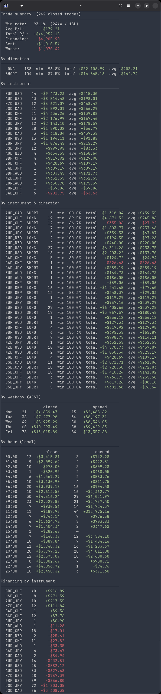

# Command reference

[← Back to README](../README.md)

`frmj sync`, `positions`, `trade`, `close`, `journal`, and `stats` act on the active account by default. Pass `--account NAME` (`-a NAME`) to target another configured account for that one command without switching the active account; the output then begins by naming it. `journal` and `stats` also accept `--all-accounts` (`-A`) to cover every account at once.

## `frmj sync`

Pull transactions from Oanda into the local database.

```sh
frmj sync               # incremental (only new transactions since last sync)
frmj sync --cold        # full history re-fetch (safe to re-run; duplicates are skipped)
frmj sync --watch       # poll for new transactions continuously (Ctrl+C to stop)
frmj sync --watch --interval 30   # poll every 30 seconds (default: 60)
frmj sync --csv history.csv       # import an Oanda Hub CSV export instead of hitting the API
frmj sync --account funded        # sync a non-active account
```

`--csv` imports a transaction-history export from the Oanda account hub (Reports → Transaction History → Export to csv). Set the export dialog's Timezone to UTC before downloading — any other timezone is rejected. Useful for backfilling history the REST API can no longer return (old accounts truncate `/transactions`) and for cross-checking an API sync against the account's own records; duplicate rows are skipped the same way `--cold` re-runs are. Cannot be combined with `--cold` or `--watch`. The CSV itself carries no account ID, so rows are filed under the active account, or under `--account NAME` when given.

## `frmj positions`

Show all open trades with live P/L, margin, TP/SL levels, any trailing stop, and an estimated daily financing charge (in home currency, colored green/red — not the raw annualized rate), plus an account summary footer. The footer includes Oanda's margin closeout percent; at 100% Oanda begins closing positions.

A trailing stop shows its current trigger price, the P/L if it triggers there, and the distance it trails by in price units: `Trail: 1.10150 (+$10.00) [0.00200 behind]`. The trigger moves as the trade goes your way, so a positive figure means the stop has locked in profit.

Pending entry orders (limit, stop, and market-if-touched — e.g. from `frmj trade --limit`) are listed in their own section below the open trades, with their price, units, time in force, TP/SL and any trailing stop, and the current market price on the side they would fill against (ask for a long, bid for a short). Cancelling a pending order is done in Oanda's own interface for now.

```sh
frmj positions
```

## `frmj financing`

Show current long/short financing rates for every tradable FX pair (Oanda's own "daily financing rates" — annualized percentages, republished daily). Pairs are grouped Majors / Minors / Exotics, alphabetical within each group; metals (XAU, XAG, ...) are excluded since the major/minor/exotic taxonomy doesn't apply to them.

```sh
frmj financing
```

A negative rate means you pay to hold that side overnight; a positive rate means you're paid.

Each live fetch also records that day's rates locally, since Oanda's API only exposes the current rate (no historical endpoint). Use `--date` to look up a previously recorded snapshot instead of fetching live:

```sh
frmj financing --date 2026-04-01
```

Only dates `frmj financing` was actually run on have data — there's no way to backfill earlier dates. Use `--quiet` to fetch and record silently (no output on success; errors still print and exit 1) for an unattended daily cron job:

```sh
frmj financing --quiet
```

```cron
0 0 * * * /path/to/frmj financing --quiet
```

## `frmj trade`

Interactive trade planning and execution flow.

```sh
frmj trade EUR_USD long
frmj trade USD_JPY short
frmj trade AUD_USD long --dry-run    # show plan only; no order placed
frmj trade --resume                  # execute a previously saved draft plan
frmj trade EUR_USD long --multi my-props   # fan the same trade out to a saved account group
frmj trade EUR_USD long --account funded   # trade a non-active account
frmj trade EUR_USD long --limit      # place a GTC limit entry order instead of a market order
frmj trade EUR_USD long --trail      # also set a trailing stop-loss
```

The flow:

1. Fetches live account state (NAV, available margin, open trade count) and live price.
2. Runs the risk model to determine capital to deploy and enforce [trade limits](configuration.md#trade-limits-and-correlation): the open-trade cap, scale-in policy, and correlated-position check.
3. Computes position size (units, margin required, pip value).
4. Displays the trade plan: NAV, open trades, capital at risk, units, margin, pip value, and entry price.
5. Prompts for take-profit and stop-loss (pips or `%` return-on-margin), and a trailing stop with `--trail`.
6. Displays exit prices, projected P/L, and R:R ratio.
7. Confirms before placing the order (`y` / `n` / `e` to re-enter TP/SL and any trailing stop).
8. Places a market order (or a limit order with `--limit`, see below); on failure, prompts to retry, save the draft, or abort.
9. Attaches TP/SL and any trailing stop to the open trade on Oanda (a limit order carries them instead).
10. Syncs the fill into the local journal.
11. Prompts for an optional note and tags.

**TP/SL input formats:**

| Input | Meaning |
|---|---|
| `50` or `50p` | 50 pips |
| `5%` | 5% return on margin used |

If the account being traded (the active account, or `--account NAME`) is a live account and live mode is not enabled, the `trade` command exits with a clear error before placing any order.

If the order placement request times out or fails, the plan can be saved (`s`) and resumed later with `frmj trade --resume`. The saved plan records the account it was planned for, and `--resume` places the order on that account even if the active account has since changed. It follows the account through `frmj account rename`, and refuses to place the order if that Oanda account is no longer configured, even if another account now has its old name. `--account` cannot be combined with `--resume` or `--multi`.

**`--limit`** (`-l`) places a GTC limit entry order instead of a market order. After the risk check, the current bid/ask is shown and you're prompted for the entry:

| Input | Meaning |
|---|---|
| `15` or `15p` | 15 pips better than the market — below the ask for a long, above the bid for a short |
| `@1.0950` | the limit price itself |
| `0.5%` | 0.5% of the current price (a percent of *price*, not of margin as for TP/SL) |

A price that would fill immediately (at or above the ask for a long, at or below the bid for a short) is rejected and re-prompted. TP/SL, R:R, and financing in the plan are computed at the limit price; the unit count is sized at current conversion rates. TP/SL are sent with the order and Oanda applies them when it fills, so there is no separate attach step. The entry's note, tags, and TP/SL plan are stored against the pending order and move to its fill on the next `frmj sync` after it fills. If Oanda fills the order the moment it arrives (the market crossed the price first), it is reported as filled and journaled on the fill directly. A saved draft remembers the limit price, so `--resume` places it as a limit order again. `--limit` cannot be combined with `--resume` or `--multi`.

**`--trail`** (`-t`) adds a trailing stop-loss prompt after the stop-loss one, in pips (`20` or `20p`; Enter skips). Oanda keeps the stop that far behind the price and moves it only in the trade's favour. It trails the side of the book the trade would close at (the bid for a long, the ask for a short), so it starts one spread further from entry than a fixed stop-loss of the same pips. The plan's Trail row shows where it starts and the loss there, spread included:

```
  SL: 1.09010  →  $-909.09  (-45.5% RoM)
  Trail: 20.0p  →  starts at 1.09790  →  $-200.00  (-10.0% RoM, incl. spread)
  R:R  2.27
```

A fixed stop-loss and a trailing stop can be set together; Oanda closes the trade on whichever triggers first, and R:R is measured against the tighter of the two. A distance outside the instrument's allowed trailing-stop range is rejected and re-prompted. On a market order the trailing stop is attached after the fill, like TP/SL; a limit order carries it and Oanda sets it when the order fills. The distance is saved in the trade plan (shown by `frmj journal`) and in a saved draft. It works with `--limit` and `--multi` (the same distance on every account, `--opposite` ones included) but cannot be combined with `--resume`, which uses the saved draft's trailing stop.

**`--multi GROUP`** places the same trade on every account in a saved group (see [`frmj account group`](#frmj-account-group) below) instead of just the active account. Risk, sizing, and correlation are evaluated independently per account (each has its own NAV and open positions); the instrument and TP/SL choice are shared, and a single confirmation covers the whole group. Not supported together with `--resume`.

**`--opposite ACCOUNT`** (repeatable), only with `--multi`, names accounts within the group that take the *other* side of the trade — short when the dialog's direction is long, long when short. TP/SL are mirrored automatically (the same pips/%RoM target applied to the opposite direction naturally lands on the mirrored price). Every named account must already be a member of the group.

## `frmj close`

Close all open tickets for an instrument.

```sh
frmj close EUR_USD
```

Shows each ticket's current P/L, prompts for confirmation, then runs an incremental sync after closing.

## `frmj stats`

Show trade performance statistics from the local journal. Auto-syncs before displaying. Only the active account's trades are counted unless `--account NAME` or `--all-accounts` is given (not both); the report begins with `Account: NAME` or `Accounts: all` so combined figures can't be mistaken for one account's.

```sh
frmj stats                    # active account
frmj stats --account prop-1   # another account (-a), without switching
frmj stats --all-accounts     # every account combined (-A)
```

Output includes: win rate, average P/L, total P/L, total financing, and best/worst trade; breakdowns by direction (long/short), instrument, instrument & direction (omitted when every pair was only traded one way), weekday (fixed UTC+10 AEST, no DST), hour (local timezone), and tag; and financing paid/earned by instrument. The weekday and hour tables show each bucket twice: by close time and by open time.



## `frmj journal`

Display recent transactions with any attached notes and tags. Auto-syncs before displaying. Only the active account's transactions are shown unless `--account NAME` or `--all-accounts` is given (not both).

```sh
frmj journal                          # last 20 transactions
frmj journal --number 50              # last 50 transactions
frmj journal --instrument EUR_USD     # filter by instrument
frmj journal --type ORDER_FILL        # filter by transaction type
frmj journal --since 2026-04-01       # on or after a date
frmj journal --with-notes             # only transactions with notes
frmj journal --tag breakout           # only transactions tagged 'breakout'
frmj journal --account prop-1         # another account's transactions, without switching
frmj journal --all-accounts           # include every account (-A), not just the active one
```

## `frmj export`

Export transactions to CSV or JSON for external analysis.

```sh
frmj export                                  # CSV to stdout
frmj export --format json                    # JSON to stdout
frmj export --output trades.csv              # write to file
frmj export --instrument EUR_USD --since 2026-01-01 --include-notes
```

Supports the same `--instrument`, `--type`, and `--since` filters as `journal`. Unlike `journal`, export always includes every account in the local database (the `account_id` column tells them apart) and does not sync first — run `frmj sync` beforehand for up-to-date data.

## `frmj note`

Attach a free-text note to any transaction by its Oanda transaction ID.

```sh
frmj note 12345 "Entered on 4H breakout, tight spread"
```

Run `frmj sync` first if the transaction is not yet in the local database. Oanda transaction IDs are only unique within one account, so `note` and `tag` look the ID up in the active account; to annotate another account's transaction, switch to it first with `frmj account use NAME`.

## `frmj tag`

Attach one or more short labels to a transaction.

```sh
frmj tag 12345 breakout london-open
```

Tags are normalised to lowercase. Only letters, digits, hyphens, and underscores are allowed. Like `note`, `tag` works on the active account's transactions.

## `frmj account`

Manage named Oanda account profiles.

```sh
frmj account add NAME              # add a new account profile (prompts for Oanda ID and type)
frmj account list                  # list all configured accounts
frmj account use NAME              # set NAME as the active account
frmj account current               # show the currently active account
frmj account rename OLD NEW        # rename a profile (keeps its Oanda ID, groups, and active status)
frmj account remove NAME           # remove a profile and its group memberships (not the active one; its token is kept)
frmj account set-token practice    # store or update the practice API token
frmj account set-token live        # store or update the live API token
```

API tokens belong to an environment (practice or live), not to one account — see [API tokens](configuration.md#api-tokens).

### `frmj account group`

Named, reusable sets of accounts, used by `frmj trade --multi GROUP` to place the same trade on several accounts at once. A group may freely mix practice and live accounts.

```sh
frmj account group add my-props alpha    # add 'alpha' to group 'my-props' (creates the group if new)
frmj account group add my-props beta
frmj account group remove my-props beta  # remove one member
frmj account group list                  # list all groups and their members
frmj account group show my-props         # show one group's members
frmj account group delete my-props       # delete the group entirely
```

## `frmj mode`

Control whether live order placement is enabled. This is independent of account selection and acts as an additional confirmation gate.

```sh
frmj mode practice    # disable live order placement (safe default)
frmj mode live        # enable live order placement (requires typing "ENABLE LIVE")
```

## `frmj config`

```sh
frmj config set max_open_trades 6  # set a config key
frmj config get max_open_trades    # read one key
frmj config get                    # show all keys + token status
frmj config unset risk_strategy    # remove a key (resets to default)
frmj config check                  # validate all config, report issues
frmj config check --connectivity   # also verify credentials against the API
frmj config set-token              # store the API token for the active account's environment
frmj config unset-token            # remove the API token for the active account's environment
```

The keys and their meanings are listed under [Config table keys](configuration.md#config-table-keys-set-with-frmj-config-set).
