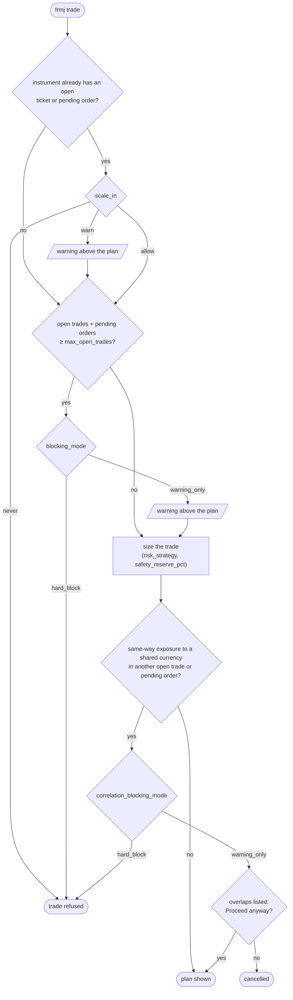

# Configuration

[← Back to README](../README.md)

For a first-time walkthrough, see [Quick start](../README.md#quick-start) in the README.

## API tokens

Oanda issues one API token per environment (practice vs live), not per account. Tokens are stored by environment in the OS keychain:

```sh
frmj account set-token practice    # store practice token (prompted, never echoed)
frmj account set-token live        # store live token (prompted, never echoed)
frmj account set-token             # defaults to the active account's environment type
frmj config unset-token            # remove the token for the active account's environment
```

Backed by GNOME Keyring / KWallet on Linux, Keychain on macOS, Credential Locker on Windows.

## Switching between accounts

```sh
frmj account use practice    # activate the 'practice' profile
frmj account use funded      # activate the 'funded' profile
frmj account current         # show which account is active
frmj account list            # show all configured accounts
```

## Execution mode (practice vs. live)

Account selection and execution mode are kept separate as an additional safety gate. Switching to a live account does not automatically enable live order placement — you must also enable live mode explicitly:

```sh
frmj mode practice           # disable live order placement (safe default)
frmj mode live               # enable live order placement (requires confirmation)
```

`frmj mode live` displays the active account name and requires typing `ENABLE LIVE` exactly before proceeding. This prevents accidental live trades when testing new workflows.

Live mode is a single switch for the whole installation, not a per-account setting: once enabled, it allows orders on every live account, including ones reached with `--account` or `trade --multi`. Run `frmj mode practice` when you're done.

## Status at a glance

```sh
frmj status
```

Shows the active account name, type (practice / live), Oanda account ID, and current execution mode.

## Environment Variables

| Variable | Required | Description |
|---|---|---|
| `OANDA_API_TOKEN_PRACTICE` | No | API token for practice accounts. Takes priority over the OS keychain. |
| `OANDA_API_TOKEN` | No | API token for live accounts. Takes priority over the OS keychain. Also used as a fallback for practice accounts when no practice token is set. |
| `FRMJ_DB_PATH` | No | Path to the SQLite file. Defaults to `~/.local/share/frmj/frmj.db` on Linux, `~/Library/Application Support/frmj/frmj.db` on macOS, and `%APPDATA%\frmj\frmj.db` on Windows. On macOS and Windows, a database already at the Linux path from an earlier version keeps being used there. |

## Config table keys (set with `frmj config set`)

Each account has its own value for every key below: `frmj config set KEY VALUE` sets it on the active account, and `--account NAME` (`-a NAME`) on another. Accounts don't share values, so changing one account's settings never affects another's; an unset key uses the default shown. A newly added account starts with nothing set, so trading on it is disabled until you set its `max_open_trades`.

Databases from before per-account config had one set of values for all accounts; on upgrade those values are copied to every existing account, so each keeps behaving as before.

Account IDs and active account selection are managed via `frmj account`, not `frmj config set`. The following keys are valid:

| Key | Required | Default | Description |
|---|---|---|---|
| `max_open_trades` | Yes | — | Maximum concurrent open tickets (e.g. `6`) |
| `risk_strategy` | No | `remaining_margin_fraction` | Sizing strategy (see [Risk model](#risk-model)) |
| `blocking_mode` | No | `hard_block` | `hard_block` or `warning_only` at the trade cap (see [Trade limits](#trade-limits-and-correlation)) |
| `scale_in` | No | `never` | `never`, `warn`, or `allow` for same-instrument adds (an open ticket or pending order on the instrument) |
| `correlation_blocking_mode` | No | `warning_only` | `hard_block` or `warning_only` for correlated open positions or pending orders |
| `safety_reserve_pct` | No | `0` | Fraction of equity to never deploy, e.g. `0.10` for 10% |
| `atr_period` | No | `14` | Days in the daily ATR that `frmj trade` shows and bases its default stop-loss on |
| `sl_atr_multiple` | No | `1.5` | Default stop-loss distance as a multiple of daily ATR (see [`frmj trade`](commands.md#frmj-trade)) |
| `percent_of_equity` | Conditional | — | Required when `risk_strategy = percent_of_equity` |
| `fixed_dollar` | Conditional | — | Required when `risk_strategy = fixed_dollar` |

## Risk model

Three sizing strategies are supported:

**`remaining_margin_fraction`** (default) — the primary strategy. With `M` max trades and `N` currently open, the next trade deploys `1 / (M + 1 - N)` of available margin. This produces an invariant: over `M` filled trades, each consumes exactly `1/(M+1)` of the original margin, leaving a permanent `1/(M+1)` buffer as breathing room for margin calls. No parameter needed beyond `max_open_trades`.

**`percent_of_equity`** — a fixed fraction of total account equity, regardless of open trades. Set `percent_of_equity` config key.

**`fixed_dollar`** — a fixed dollar amount per trade. Set `fixed_dollar` config key.

All strategies respect `safety_reserve_pct`: that fraction of equity is subtracted from available margin before any formula is applied.

**Pending entry orders** (limit, stop, market-if-touched) are treated as if they had already filled, for market and limit trades alike: each one counts toward `N` and the `max_open_trades` cap, its estimated margin at current prices is subtracted from available margin before sizing, and it counts for the `scale_in` and correlation checks. Oanda sets aside no margin for a pending order, so without this a new trade could leave too little margin for it to fill. The trade plan shows them next to open trades, e.g. `Open trades: 2 / 6 (+1 pending)`.

## Trade limits and correlation

Before sizing a trade, `frmj trade` runs three checks. Each either refuses the trade outright or lets it through with a warning:

- **Trade cap** (`max_open_trades`, `blocking_mode`) — opening a trade beyond `max_open_trades` is refused with `hard_block` (the default), or allowed with a warning printed above the plan with `warning_only`.
- **Scale-in** (`scale_in`) — adding to an instrument that already has an open ticket or pending order is refused with `never` (the default), allowed with a warning printed above the plan with `warn`, or allowed silently with `allow`.
- **Correlated positions** (`correlation_blocking_mode`) — a trade is *correlated* with an open ticket or pending order on a different instrument when both bet the same way on a shared currency. Long `EUR_USD` and long `EUR_GBP` are both long EUR; long `EUR_USD` and short `USD_JPY` are both short USD. This compares direction only, not position size. With `warning_only` (the default) each overlap is listed and you must answer an extra "Proceed anyway?" prompt; with `hard_block` the trade is refused.

The checks run in this order, so a trade that breaks more than one rule is told about the most specific one first:



At the cap with `warning_only`, `remaining_margin_fraction` sizes the trade as if it were the last one allowed (half of usable margin), since its formula has no meaning past the cap. A sized trade that comes out below the instrument's minimum units is also refused.

With `trade --multi`, all three checks run separately for each account in the group, each against that account's own settings. A refusal on any account stops the whole trade before any order is placed, and the correlation overlaps from every account share one "Proceed anyway?" prompt.

